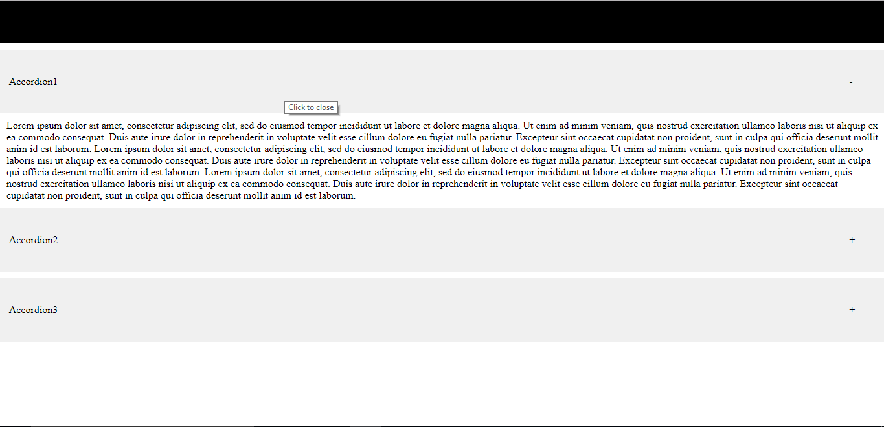
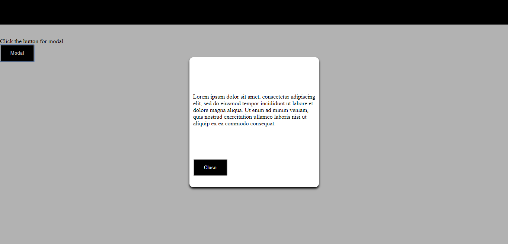

# No Bootstrap

Three bootstrap components i.e accordion, modal and navbar is made using HTML and CSS only (no bootstrap is used).

[Click here](https://sharan3009.github.io/no-bootstrap/accordion) to check accordion. 
[Click here](https://sharan3009.github.io/no-bootstrap/modal) to check modal. 
[Click here](https://sharan3009.github.io/no-bootstrap/navbar) to check navbar.

### Screenshots
  
### Accordion
 
### Modal
 
### Navbar

### Built With
* HTML5
* CSS3